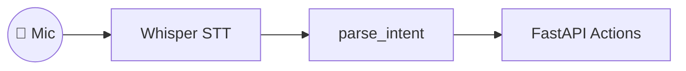

# TaskWhisper 🗣️🚀

*Voice-first task orchestrator that turns everyday conversations into actionable to-dos for crews & staff.*

<div align="center">
  
</div>

## ✨ ¿Qué es?

TaskWhisper escucha diálogos (por ejemplo, camarero–cliente o jefe de obra–equipo),  
transcribe el audio con **Whisper**, detecta la **intención** con un LLM y dispara la acción correcta
(enviar orden a cocina, crear reserva, asignar check-list, etc.).  
Todo en tiempo real y sin manos.

## 🍱 Tech-stack

| Capa | Tech |
|------|------|
| STT | OpenAI Whisper v3 (o Deepgram) |
| NLU | GPT-4o function-calling |
| Orquestación | LangChain + FastAPI |
| Mobile | React-Native (expo) |
| Infra | Docker Compose + PostgreSQL |

## 🏗️ Architecture



- **Captura**: obtiene audio desde un micrófono o stream.
- **STT**: Whisper transforma voz a texto.
- **NLU**: `parse_intent` identifica la intención.
- **Orquestador**: FastAPI ejecuta la acción correspondiente.

## 🚀 Quick Start

Clona el repositorio y crea un entorno virtual:

```bash
git clone https://github.com/tu-user/taskwhisper.git
cd taskwhisper
```

### Linux / macOS

```bash
python3 -m venv .venv
source .venv/bin/activate
pip install -r backend/requirements.txt
uvicorn backend.app.main:app --reload
```

### Windows

```powershell
python -m venv .venv
.\.venv\Scripts\activate
pip install -r backend/requirements.txt
uvicorn backend.app.main:app --reload
```

La API estará disponible en `http://localhost:8000`.

## 📡 Example

### curl

```bash
curl http://localhost:8000/
curl -X POST http://localhost:8000/parse_intent \
  -H "Content-Type: application/json" \
  -d '{"text": "Necesito agendar una cita"}'
```

### Python `requests`

```python
import requests

requests.get("http://localhost:8000/").json()
requests.post(
    "http://localhost:8000/parse_intent",
    json={"text": "Necesito agendar una cita"},
).json()
```

